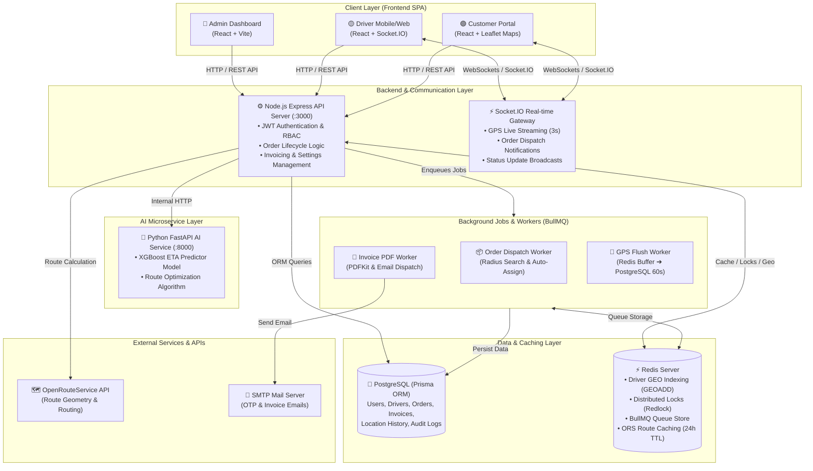

# 🚚 BÁO CÁO TỔNG HỢP KIẾN TRÚC HỆ THỐNG & NHẬT KÝ PHÁT TRIỂN SMARTFLEET

> **Dự án:** SmartFleet — Systems Architecture, Features Implemented & Key Learnings  
> **Tác giả / Thực hiện:** Hồ Hữu Quang Sang (`hohquangsang`)  
> **Thời gian:** Tháng 08/2026 – Tháng 09/2026  
> **Thư mục dự án:** `c:\Intern\smart_fleet`

---

## 📋 MỤC LỤC
1. [Tổng Quan Hệ Thống SmartFleet](#1-tổng-quan-hệ-thống-smartfleet)
2. [Kiến Trúc Hệ Thống Chi Tiết (System Architecture)](#2-kiến-trúc-hệ-thống-chi-tiết-system-architecture)
   - [2.1 Sơ đồ Kiến trúc Tổng thể](#21-sơ-đồ-kiến-trúc-tổng-thể)
   - [2.2 Chi tiết 3 Microservices Chính](#22-chi-tiết-3-microservices-chính)
   - [2.3 Data Layer & Caching / Message Queue](#23-data-layer--caching--message-queue)
   - [2.4 Tích hợp Dịch vụ Bên thứ ba (External Services)](#24-tích-hợp-dịch-vụ-bên-thứ-ba-external-services)
3. [Các Công Việc & Tính Năng Đã Xử Lý trong Hệ Thống](#3-các-công-việc--tính-năng-đã-xử-lý-trong-hệ-thống)
   - [3.1 Khởi tạo Kiến trúc & Thiết kế Cơ sở Dữ liệu](#31-khởi-tạo-kiến-trúc--thiết-kế-cơ-sở-dữ-liệu)
   - [3.2 Thiết kế UI/UX & Xây dựng Frontend Multi-Role](#32-thiết-kế-uiux--xây-dựng-frontend-multi-role)
   - [3.3 Luồng Xử lý Đặt hàng & Dispatching Tự động (Customer ➔ Driver)](#33-luồng-xử-lý-đặt-hàng--dispatching-tự-động-customer--driver)
   - [3.4 Hệ thống Định vị GPS Real-time & Flush Buffer](#34-hệ-thống-định-vị-gps-real-time--flush-buffer)
   - [3.5 Quản trị Hệ thống Admin & Audit Log](#35-quản-trị-hệ-thống-admin--audit-log)
   - [3.6 Luồng Xác thực, OTP & Quên Mật khẩu (Auth & Security)](#36-luồng-xác-thực-otp--quên-mật-khẩu-auth--security)
   - [3.7 Tích hợp AI Service (Dự đoán ETA với XGBoost & Fallback Mechanism)](#37-tích-hợp-ai-service-dự-đoán-eta-với-xgboost--fallback-mechanism)
   - [3.8 Xuất Hóa đơn PDF Bất đồng bộ & Gửi Email](#38-xuất-hóa-đơn-pdf-bất-đồng-bộ--gửi-email)
4. [Bảng Tổng Hợp Lịch Sử Commit (Git Contributions)](#4-bảng-tổng-hợp-lịch-sử-commit-git-contributions)
5. [Những Kiến Thức & Kỹ Năng Đã Học Được (Key Learnings)](#5-những-kiến-thức--kỹ-năng-đã-học-được-key-learnings)
   - [5.1 Tư duy Kiến trúc Hệ thống & Microservices](#51-tư-duy-kiến-trúc-hệ-thống--microservices)
   - [5.2 Kỹ thuật Real-time & Tối ưu hóa Redis Buffer](#52-kỹ-thuật-real-time--tối-ưu-hóa-redis-buffer)
   - [5.3 Làm chủ Concurrency & Distributed Locking (Redlock)](#53-làm-chủ-concurrency--distributed-locking-redlock)
   - [5.4 Xử lý Tác vụ Bất đồng bộ với BullMQ Queue](#54-xử-lý-tác-vụ-bất-đồng-bộ-với-bullmq-queue)
   - [5.5 Xử lý Dữ liệu Không gian (Geo-Spatial Indexing)](#55-xử-lý-dữ-liệu-không-gian-geo-spatial-indexing)
   - [5.6 Đóng gói & Tích hợp Model AI vào Production](#56-đóng-gói--tích-hợp-model-ai-vào-production)
6. [Lời Kết & Hướng Phát Triển Mở Rộng](#6-lời-kết--hướng-phát-triển-mở-rộng)

---

## 1. TỔNG QUAN HỆ THỐNG SMARTFLEET

**SmartFleet** là một nền tảng quản lý đội xe và vận tải thông minh toàn diện (Smart Fleet Management & Real-time Logistics System). Hệ thống được thiết kế nhằm giải quyết bài toán điều phối xe tải/giao hàng theo thời gian thực, tự động hóa quy trình ghép đơn cho tài xế gần nhất, dự đoán chính xác thời gian giao hàng (ETA) bằng thuật toán Học Máy (Machine Learning), đồng thời cung cấp giao diện quản trị chuyên nghiệp cho 3 nhóm đối tượng:

- 🔴 **Admin (Quản trị viên):** Giám sát toàn bộ hệ thống, điều phối tài xế, quản lý người dùng, cấu hình tiền tệ/ngôn ngữ/SMTP và theo dõi nhật ký hoạt động (Audit Logs).
- 🟡 **Driver (Tài xế):** Nhận đơn hàng real-time, chấp nhận/từ chối chuyến đi, cập nhật tọa độ GPS liên tục và theo dõi doanh thu cá nhân.
- 🟢 **Customer (Khách hàng):** Đặt chuyến giao hàng, ước tính cước phí & ETA, theo dõi vị trí xe chạy trên bản đồ thời gian thực, xem lịch sử và tải hóa đơn PDF.

---

## 2. KIẾN TRÚC HỆ THỐNG CHI TIẾT (SYSTEM ARCHITECTURE)

SmartFleet áp dụng kiến trúc **Service-Oriented Architecture (SOA) / Microservices nhẹ**, phân tách rõ ràng giữa giao diện (Frontend), nghiệp vụ cốt lõi (Node.js Backend API), dịch vụ AI (Python FastAPI), và lớp lưu trữ dữ liệu đa tầng (PostgreSQL + Redis).

### 2.1 Sơ đồ Kiến trúc Tổng thể



---

### 2.2 Chi tiết 3 Microservices Chính

#### 1. Frontend Client (`/frontend`)
- **Công nghệ:** React 19, Vite 8, TypeScript, React Router 7, TailwindCSS / CSS Modules.
- **Tính năng nổi bật:**
  - **Single Page Application (SPA)** với phân quyền định tuyến (Role-based Protected Routes).
  - Tích hợp **React-Leaflet** cho phép hiển thị bản đồ vector, vẽ tuyến đường di chuyển (Polylines), hiển thị icon xe cẩu/xe tải di chuyển mượt mà dựa trên dữ liệu GPS real-time.
  - Tích hợp **Socket.IO Client** để lắng nghe sự kiện tức thì khi có tài xế nhận đơn, thay đổi trạng thái đơn hàng, hoặc cập nhật tọa độ.
  - Hỗ trợ đa ngôn ngữ **i18next** (Tiếng Việt / Tiếng Anh) và hệ thống **Recharts** thống kê doanh thu visual.

#### 2. Backend API Gateway & Business Core (`/backend`)
- **Công nghệ:** Node.js, Express.js 5, Prisma ORM 5.22, Socket.IO 4.8, Zod Validation, Helmet Security.
- **Vai trò:**
  - Quản lý toàn bộ luồng nghiệp vụ (Business Rules), RESTful APIs (`/auth`, `/users`, `/drivers`, `/orders`, `/admin`, `/invoices`, `/maps`).
  - Đóng vai trò WebSocket Gateway điều phối tin nhắn giữa Driver và Customer.
  - Quản lý giao dịch cơ sở dữ liệu với Prisma ORM.

#### 3. AI Service (`/ai-service`)
- **Công nghệ:** Python 3.10+, FastAPI, XGBoost, Scikit-learn, Pandas, Pydantic.
- **Mục đích:**
  - Endpoint `POST /api/predict-eta`: Nhận thông tin quãng đường, số khúc rẽ, khung giờ trong ngày, tình trạng giao thông để đưa ra dự đoán thời gian hoàn thành đơn hàng (ETA) với mô hình XGBoost đã qua huấn luyện.
  - Endpoint `POST /api/optimize-route`: Tính toán thứ tự điểm giao hàng tối ưu cho các chuyến đi nhiều điểm dừng (TSP / VRP problem).

---

### 2.3 Data Layer & Caching / Message Queue

| Thành phần | Công nghệ | Vai trò & Lý do lựa chọn |
|---|---|---|
| **Primary Database** | PostgreSQL | Cơ sở dữ liệu quan hệ mạnh mẽ, đảm bảo tính toàn vẹn dữ liệu (ACID) cho giao dịch tài chính, đơn hàng và tài khoản. |
| **ORM Layer** | Prisma ORM | Type-safe database client, hỗ trợ migration tự động và seed dữ liệu mẫu nhanh chóng. |
| **In-Memory Cache & Geo** | Redis (ioredis) | - **Geo-Spatial Indexing:** Lưu vị trí tài xế qua `GEOADD` và truy vấn bán kính `GEORADIUS` siêu nhanh ($O(N + \log M)$).<br>- **Route Cache:** Cache kết quả tính đường từ OpenRouteService trong 24 giờ.<br>- **GPS Buffer:** Lưu vị trí tức thời trước khi flush xuống PostgreSQL. |
| **Distributed Lock** | Redlock | Khóa phân tán dựa trên Redis để ngăn chặn hiện tượng Race Condition (nhiều tài xế tranh nhau nhận cùng 1 đơn hàng). |
| **Async Task Queue** | BullMQ | Quản lý các hàng đợi công việc nền (`order.queue`, `invoice.queue`, `gps-flush.queue`) độc lập với tiến trình HTTP chính. |

---

### 2.4 Tích hợp Dịch vụ Bên thứ ba (External Services)

1. **OpenRouteService (ORS API):** Tính khoảng cách di chuyển thực tế theo đường bộ, thời gian di chuyển lý thuyết và trả về mảng tọa độ (Geometry Encoded Polyline) để vẽ tuyến đường trên bản đồ.
2. **Nodemailer (SMTP):** Gửi mã OTP xác thực email khi đăng ký/quên mật khẩu và gửi email hóa đơn kèm PDF đính kèm.
3. **PDFKit:** Engine hỗ trợ render file PDF hóa đơn chuyên nghiệp trực tiếp ở phía server backend.

---

## 3. CÁC CÔNG VIỆC & TÍNH NĂNG ĐÃ XỬ LÝ TRONG HỆ THỐNG

Dựa trên quá trình phân tích codebase và nhật ký Git (`git log`), các hạng mục công việc quan trọng đã được xử lý bao gồm:

```
    ┌────────────────────────────────────────────────────────────────────────┐
    │                        LỘ TRÌNH PHÁT TRIỂN SMARTFLEET                  │
    └────────────────────────────────────────────────────────────────────────┘
       Phase 1: Architecture & UI Base (06/08 - 07/08/2026)
       Phase 2: Customer ➔ Driver Ordering Flow & Realtime Socket (10/08 - 13/08/2026)
       Phase 3: Admin & Driver Management, Auth OTP (14/08 - 20/08/2026)
       Phase 4: Admin Settings, System Management & UI Refinement (03/09 - 11/09/2026)
       Phase 5: AI ETA Integration & README Documentation (15/09 - 17/09/2026)
```

### 3.1 Khởi tạo Kiến trúc & Thiết kế Cơ sở Dữ liệu
- **Thiết kế Schema Prisma (`schema.prisma`):**
  - Xây dựng 8 bảng dữ liệu quan hệ chuẩn hóa: `User`, `Driver`, `Order`, `OrderStatusHistory`, `DriverLocationHistory`, `Invoice`, `SystemConfig`, `AuditLog`.
  - Thiết lập các Enum rõ ràng: `Role` (`ADMIN`, `DRIVER`, `CUSTOMER`), `DriverStatus` (`PENDING_APPROVAL`, `APPROVED`, `REJECTED`, `SUSPENDED`), `OrderStatus` (`PENDING`, `DISPATCHING`, `DRIVER_ACCEPTED`, `MATCHED`, `IN_TRANSIT`, `PICKED_UP`, `DELIVERED`, `COMPLETED`, `CANCELLED`, `EXPIRED_NO_DRIVER`).

### 3.2 Thiết kế UI/UX & Xây dựng Frontend Multi-Role
- **Thiết lập giao diện chuyên nghiệp (commit `2f3659b`, `7f9a5f6`, `3b749ed`):**
  - Xây dựng Layout đồng bộ với Sidebar linh hoạt, Topbar hiển thị avatar, số dư, thông báo và bộ chuyển đổi ngôn ngữ (VI / EN).
  - Áp dụng thiết kế giao diện hiện đại (Modern Dark/Glassmorphism Theme) giúp tăng sự tin cậy và trải nghiệm mượt mà.
  - Phân chia module rõ ràng trong thư mục `src/pages/`: `admin/`, `driver/`, `customer/`.

### 3.3 Luồng Xử lý Đặt hàng & Dispatching Tự động (Customer ➔ Driver)
- **Xây dựng luồng tạo đơn và điều phối xe (commit `8a6a7da`, `1fba5a0`, `7d87f68`):**
  - **Khách hàng:** Nhập điểm đón / điểm trả trên bản đồ ➔ Hệ thống tự động tính quãng đường (ORS) ➔ Gọi AI Service tính ETA ➔ Tính giá tiền dự kiến ➔ Khách hàng xác nhận tạo đơn (`PENDING`).
  - **Hệ thống Dispatching (BullMQ `order.worker.js`):**
    1. Đơn hàng chuyển sang trạng thái `DISPATCHING`.
    2. Sử dụng `redis-geo.service.js` để tìm các tài xế có trạng thái `APPROVED` + `ACTIVE` (đang bật nhận chuyến) trong bán kính `DISPATCH_RADIUS_KM` (mặc định 5km).
    3. Gửi thông báo real-time qua Socket.IO tới danh sách tài xế phù hợp.
  - **Tài xế Chấp nhận Đơn (`driver.socket.js`):**
    - Sử dụng **Redlock** để lấy lock `lock:order:{orderId}`.
    - Tài xế bấm "Nhận chuyến" đầu tiên sẽ chiếm được lock, chuyển trạng thái đơn hàng sang `DRIVER_ACCEPTED` ➔ `MATCHED`. Các tài xế ấn sau sẽ nhận thông báo đơn hàng đã được nhận bởi tài xế khác.

### 3.4 Hệ thống Định vị GPS Real-time & Flush Buffer
- **Tối ưu hóa ghi vị trí GPS (`driver.socket.js` & `gps-flush.worker.js`):**
  - Khi xe di chuyển, ứng dụng Driver gửi vị trí (lat, lng, heading, speed) lên Socket Server mỗi 3 giây.
  - **Truyền thông tức thì (Live Broadcast):** Socket Server phát ngay tọa độ mới tới Customer đang theo dõi đơn hàng để Marker di chuyển trên Leaflet map.
  - **Đệm Redis (Redis Geo Buffer):** Tọa độ được cập nhật trực tiếp vào Redis Geo Index để phục vụ việc tra cứu tài xế xung quanh.
  - **Flush định kỳ (Write-Behind Buffer):** Worker `gps-flush.worker.js` chạy mỗi 60 giây gom toàn bộ vị trí gần nhất trong Redis đẩy thành một batch ghi vào bảng `driver_locations_history` của PostgreSQL, giảm tải I/O ghi trực tiếp hàng nghìn query SQL mỗi phút.

### 3.5 Quản trị Hệ thống Admin & Audit Log
- **Xây dựng bộ công cụ Admin chuyên sâu (commit `ab2dc71`, `abbfa02`, `5f36324`, `cfbe042`):**
  - **Duyệt hồ sơ Tài xế:** Admin xem thông tin biển số xe, hình ảnh CCCD/Bằng lái và bấm Phê duyệt (`APPROVED`) hoặc Từ chối (`REJECTED`).
  - **Audit Logs System:** Ghi lại mọi hành động nhạy cảm của Admin (Duyệt tài xế, Đổi cấu hình hệ thống, Khóa tài khoản) vào bảng `audit_logs` với giao diện hiển thị phân màu (Badge: CREATE, UPDATE, DELETE, SYSTEM).
  - **System Settings:** Giao diện quản lý tham số cấu hình động (`SystemConfig`) lưu trữ dạng Key-Value trong DB (Phí mở cửa, Giá tiền mỗi KM, Bán kính quét tài xế, Cấu hình SMTP Email).

### 3.6 Luồng Xác thực, OTP & Quên Mật khẩu (Auth & Security)
- **Nâng cấp an toàn hệ thống (commit `7de3930`):**
  - Đăng nhập sử dụng JWT cặp (Access Token 15 phút + Refresh Token 7 ngày).
  - Xây dựng luồng **Quên mật khẩu (Forgot Password Flow):** Khách hàng/Tài xế nhập email ➔ Server tạo mã OTP 6 chữ số ngẫu nhiên ➔ Lưu Redis với TTL 5 phút ➔ Gửi email qua Nodemailer ➔ Người dùng nhập OTP xác minh ➔ Cho phép đặt lại mật khẩu mới được băm bằng `bcryptjs`.

### 3.7 Tích hợp AI Service (Dự đoán ETA với XGBoost & Fallback Mechanism)
- **Tích hợp dịch vụ trí tuệ nhân tạo (commit `0d50fa7`):**
  - Xây dựng `ai.service.js` ở Backend giao tiếp với FastAPI AI Service.
  - Khi khách hàng tạo đơn, Backend gửi dữ liệu (distance_km, pickup_time, weather, traffic_factor) sang AI Service.
  - AI Service sử dụng model XGBoost đã serialize để trả về thời gian hoàn thành chuyến đi chính xác theo điều kiện thực tế.
  - **Thiết kế Cơ chế Fallback (Graceful Fallback):** Nếu AI Service không khả dụng (Offline/Timeout), `ai.service.js` tự động bắt lỗi và tính toán ETA dự phòng dựa trên tốc độ trung bình của OpenRouteService, đảm bảo hệ thống không bao giờ bị dừng hoạt động (Zero Downtime).

### 3.8 Xuất Hóa đơn PDF Bất đồng bộ & Gửi Email
- **Tự động hóa thanh toán & chứng từ (`pdf.service.js` & `invoice.worker.js`):**
  - Khi đơn hàng hoàn thành (`COMPLETED`), một công việc mới được thêm vào BullMQ Queue `invoice-queue`.
  - Worker `invoice.worker.js` sử dụng `PDFKit` để vẽ bố cục hóa đơn bao gồm: Mã đơn, tên khách hàng, tên tài xế, tuyến đường, bảng chi tiết cước phí (Phí cơ bản, Phí quãng đường, Phí thời gian, Thuế VAT).
  - File PDF xuất ra được lưu trữ và tự động gửi đính kèm qua email xác nhận hoàn thành chuyến đi cho Khách hàng.

---

## 4. BẢNG TỔNG HỢP LỊCH SỬ COMMIT (GIT CONTRIBUTIONS)

Dưới đây là bảng thống kê toàn bộ quá trình phát triển dự án theo dòng thời gian dựa trên Git History:

| Commit Hash | Ngày | Người thực hiện | Nội dung chi tiết (Message & Scope) |
|---|---|---|---|
| `4bb7873` | 06/08/2026 | hohquangsang | `first commit` — Khởi tạo cấu trúc repository SmartFleet. |
| `500e2d8` | 06/08/2026 | hohquangsang | `System architecture` — Thiết kế sơ đồ kiến trúc 3 services, cấu hình môi trường. |
| `2f3659b` | 07/08/2026 | hohquangsang | `Thiet ke UI` — Xây dựng khung Frontend React Vite, cài đặt Tailwind/CSS và Router base. |
| `8a6a7da` | 10/08/2026 | hohquangsang | `Luong hoat dong dat hang` — Thiết lập flow đặt hàng ban đầu phía Customer. |
| `1fba5a0` | 11/08/2026 | hohquangsang | `Update luong hoat dong dat hang` — Tích hợp OpenRouteService tính tuyến đường. |
| `6192db9` | 11/08/2026 | hohquangsang | `Update Driver-Admin Function` — Xây dựng API và giao diện quản lý tài xế phía Admin. |
| `bd9787d` | 12/08/2026 | hohquangsang | `User --> Driver` — Chuyển đổi vai trò người dùng và phân quyền tài xế. |
| `a247c24` | 12/08/2026 | hohquangsang | `update admin-driver UI, function` — Hoàn thiện UI duyệt hồ sơ tài xế và xem trạng thái xe. |
| `7d87f68` | 13/08/2026 | hohquangsang | `Update luong customer-->driver(rollback)` — Tối ưu hóa Socket.IO dispatching giữa Customer & Driver. |
| `7f9a5f6` | 13/08/2026 | hohquangsang | `update UI admin` — Cải tiến giao diện Admin Dashboard với các biểu đồ thống kê. |
| `ab2dc71` | 14/08/2026 | hohquangsang | `update full Admin` — Hoàn thiện toàn bộ các tính năng quản trị Admin. |
| `7de3930` | 17/08/2026 | hohquangsang | `update forgot password flow` — Xây dựng tính năng Quên mật khẩu qua OTP Email & Redis TTL. |
| `a9f1eb2` | 18/08/2026 | hohquangsang | `update setting admin draft` — Phác thảo giao diện Cài đặt hệ thống phía Admin. |
| `abbfa02` | 20/08/2026 | hohquangsang | `update flow setting admin` — Cập nhật luồng lưu cấu hình SystemConfig. |
| `9d006db` | 20/08/2026 | hohquangsang | `check failed` — Kiểm tra và khắc phục các lỗi phát sinh trong luồng dispatching. |
| `9c84899` | 03/09/2026 | hohquangsang | `update settings for admin` — Hoàn thiện các trang cài đặt chi tiết (Profile, Accounts, SystemConfig). |
| `3b749ed` | 09/09/2026 | hohquangsang | `Update UI balance topbar/sidebar` — Cân chỉnh khoảng cách UI Header, Topbar và Sidebar. |
| `5f36324` | 10/09/2026 | hohquangsang | `Update System Management(Admin)` — Thêm Audit Logs và quản lý tài khoản Admin. |
| `cfbe042` | 11/09/2026 | hohquangsang | `fix/update System management(Admin)` — Sửa lỗi bộ lọc Audit Log và phân trang dữ liệu Admin. |
| `71fb37e` | 15/09/2026 | hohquangsang | `Add README.md` — Trình bày tài liệu chi tiết hướng dẫn cài đặt và vận hành hệ thống. |
| `0d50fa7` | 17/09/2026 | hohquangsang | `Update ETA predict time` — Tích hợp AI Service (FastAPI + XGBoost) cho dự đoán thời gian ETA. |

---

## 5. NHỮNG KIẾN THỨC & KỸ NĂNG ĐÃ HỌC ĐƯỢC (KEY LEARNINGS)

Quá trình tham gia xây dựng hệ thống **SmartFleet** từ cơ bản đến nâng cao đã mang lại những bài học kinh nghiệm thực chiến vô cùng phong phú trên nhiều khía cạnh lập trình và kiến trúc phần mềm:

### 5.1 Tư duy Kiến trúc Hệ thống & Microservices
- **Học được cách tổ chức dự án Đa dịch vụ (Multi-service Project Structure):** Hiểu rõ khi nào nên tách dịch vụ (Ví dụ: Tách AI Service sang Python FastAPI để tận dụng hệ sinh thái ML/Data Science mạnh mẽ của Python, giữ Backend ở Node.js để tận dụng khả năng xử lý Async I/O và WebSocket vượt trội).
- **Thiết kế Cơ chế Dự phòng (Graceful Degradation & Fallback):** Biết cách xây dựng hệ thống bền bỉ (Resilient System) – khi dịch vụ AI bị lỗi, backend vẫn tiếp tục hoạt động bằng thuật toán dự phòng mà khách hàng không nhận ra sự ngắt kết nối.

### 5.2 Kỹ thuật Real-time & Tối ưu hóa Redis Buffer
- **Lập trình WebSocket nâng cao với Socket.IO:** Hiểu cách quản lý kết nối (Connection lifecycle), phân nhóm phòng (`socket.join('order_' + orderId)`), phát tin tức thời (`io.to().emit()`) và xử lý tự động re-connect khi mất mạng.
- **Mô hình Write-Behind Caching:** Nhận thức rõ ràng bài toán nghẽn cổ chai DB (Database I/O Bottleneck). Học được giải pháp dùng Redis làm đệm (Buffer) ghi nhận GPS mỗi 3s, sau đó dùng Worker chạy ngầm để Flush xuống PostgreSQL theo định kỳ 60s. Giải pháp này giúp hệ thống chịu tải gấp hàng chục lần so với việc ghi SQL trực tiếp.

### 5.3 Làm chủ Concurrency & Distributed Locking (Redlock)
- **Giải quyết bài toán Race Condition:** Khi hàng trăm tài xế cùng bấm "Nhận đơn" tại cùng một mili-giây, nếu không có cơ chế khóa, đơn hàng sẽ bị gán trùng cho nhiều người.
- **Ứng dụng Redlock Algorithm:** Học cách triển khai khóa phân tán dựa trên Redis với `redlock.service.js`. Đảm bảo tính nguyên tố (Atomicity) – chỉ duy nhất 1 request chiếm được lock thành công và nhận chuyến.

### 5.4 Xử lý Tác vụ Bất đồng bộ với BullMQ Queue
- **Tư duy Unblocking I/O:** Không xử lý các tác vụ tốn thời gian (Ghép xe, tạo file PDF, gửi Email SMTP) trực tiếp trong luồng xử lý HTTP Request chính nhằm tránh làm treo phản hồi người dùng.
- **Quản lý Job Queue chuyên nghiệp:** Sử dụng BullMQ để định nghĩa các Worker xử lý tác vụ nền, cấu hình cơ chế tự động thử lại (Retry Strategy với Exponential Backoff) khi gửi email thất bại.

### 5.5 Xử lý Dữ liệu Không gian (Geo-Spatial Indexing)
- **Tối ưu hóa truy vấn tọa độ địa lý:** Thay vì dùng các câu lệnh SQL đắt đỏ (`ST_Distance` trong PostGIS), học được cách tận dụng Redis Geo (`GEOADD`, `GEORADIUS`) để tìm danh sách tài xế trong bán kính 5km với độ trễ dưới 2ms.
- **Tích hợp Bản đồ số (Leaflet / OpenStreetMap):** Hiểu cách làm việc với tọa độ địa lý (Latitude/Longitude), mã hóa đường đi (Polyline decoding), tính góc xoay biểu tượng xe tải khi di chuyển giữa 2 vị trí.

### 5.6 Đóng gói & Tích hợp Model AI vào Production
- **Quy trình đưa Model ML vào Thực tế (MLOps nhẹ):** Hiểu cách kết nối giữa lập trình web truyền thống và Học máy – đóng gói model XGBoost qua FastAPI REST API với Pydantic Validation.
- **Đo lường & Tối ưu độ trễ API:** Đảm bảo thời gian dự đoán ETA của AI Service luôn dưới 100ms để không ảnh hưởng đến trải nghiệm đặt xe tức thì của khách hàng.

---

## 6. LỜI KẾT & HƯỚNG PHÁT TRIỂN MỞ RỘNG

Dự án **SmartFleet** không chỉ là một sản phẩm phần mềm quản lý đội xe có tính ứng dụng thực tiễn cao, mà còn là minh chứng cho việc áp dụng thành công các công nghệ hiện đại nhất hiện nay: **React 19, Node.js Express, Python FastAPI, PostgreSQL, Redis, BullMQ, Socket.IO và XGBoost**.

### Hướng phát triển nâng cấp trong tương lai:
1. **Containerization & Orchestration:** Đóng gói toàn bộ 3 services với **Docker** và **Docker Compose** / **Kubernetes** để dễ dàng deploy trên môi trường Cloud (AWS / GCP).
2. **Re-routing Dynamic AI:** Nâng cấp AI Service để tự động tính toán lại đường đi khi phát hiện xe đi chệch khỏi tuyến đường dự định hoặc khi có tắc đường thời gian thực.
3. **Thanh toán Trực tuyến (Payment Gateway Integration):** Tích hợp cổng thanh toán VNPay / ZaloPay / MoMo trực tiếp vào luồng thanh toán hóa đơn.

---
*Báo cáo được tổng hợp chi tiết dựa trên toàn bộ cấu trúc mã nguồn và lịch sử phát triển của dự án SmartFleet.*
